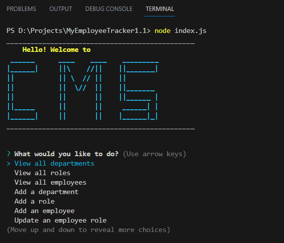

# MyEmployeeTracker1.1
  [](https://opensource.org/licenses/MIT)
 ## Description
  The Employee Tracker app is a command-line application built using Node.js, MySQL2, Inquirer, and other libraries to manage employee-related data in a database. The app provides various functionalities to interact with the employee, role, and department data, allowing users to view, add, update, and delete records.

Features of the Employee Tracker app:

1. View All Departments: Users can view a formatted table showing the department names and their corresponding IDs.

2. View All Roles: Users can view a formatted table displaying the job titles, role IDs, department names, and salaries for each role.

3. View All Employees: Users can view a formatted table showing employee data, including employee IDs, first names, last names, job titles, departments, salaries, and the names of their managers.

4. Add a Department: Users can add a new department to the database by providing the name of the department.

5. Add a Role: Users can add a new role to the database by entering the title, salary, and selecting the department to which the role belongs.

6. Add an Employee: Users can add a new employee to the database by providing their first name, last name, selecting their job role, and assigning a manager (if applicable).

7. Update an Employee Role: Users can update an employee's role by selecting the employee and choosing a new role for them.

8. View Employees by Manager: Users can view a list of employees who report to a specific manager.

9. View Employees by Department: Users can view a list of employees who belong to a particular department.

10. Delete Departments, Roles, and Employees: Users can delete departments, roles, and employees from the database.

11. View Department Budget: Users can view the total utilized budget of a specific department, which is the combined salaries of all employees in that department.

The app uses MySQL2 to establish a connection with the MySQL database and perform database operations such as querying, inserting, updating, and deleting records. Inquirer library is used to prompt the user for input and receive responses to perform different actions.

  ## Table of Contents
  - [Installation](#installation)
  - [Usage](#usage)
  - [License](#license)
  - [Deployed Link](#deployed-link)
  - [Sample Application](#sample-application)
  - [Questions](#questions)
  ## Installation <a name="installation"></a>

To install and run the Employee Tracker app, follow these steps:

1. Install Node.js:
   If you haven't already, download and install Node.js from the official website: https://nodejs.org/

2. Set up MySQL Database:
   Install and configure MySQL on your system. Create a new database and user for the Employee Tracker app. Note down the database name, username, password, and host to be used later.

3. Clone the Repository:
   Clone or download the Employee Tracker app repository from the GitHub page to your local machine.

4. Navigate to the App Directory:
   Open a terminal or command prompt and navigate to the directory where you cloned or downloaded the Employee Tracker app.

5. Install Dependencies:
   Run the following command to install the required dependencies specified in the `package.json` file:

   ```bash
   npm install
   ```

6. Create .env File:
   Create a new file named `.env` in the root directory of the app. Add the following environment variables in the `.env` file:

   ```
   DB_HOST=<Your_MySQL_Host>
   DB_PORT=<Your_MySQL_Port>
   DB_USER=<Your_MySQL_Username>
   DB_PASSWORD=<Your_MySQL_Password>
   DB_DATABASE=<Your_MySQL_Database_Name>
   ```

   Replace `<Your_MySQL_Host>`, `<Your_MySQL_Port>`, `<Your_MySQL_Username>`, `<Your_MySQL_Password>`, and `<Your_MySQL_Database_Name>` with your actual MySQL database credentials.

7. Set Up the Database Schema:
   In the root directory of the app, locate the `schema.sql` file. Copy the contents of this file and execute the SQL queries in your MySQL database to set up the required tables.

8. Seed the Database (Optional):
   If you want to populate the database with sample data, you can use the `seeds.sql` file. Copy the contents of this file and execute the SQL queries in your MySQL database.

9. Run the App:
   After setting up the database, run the following command in the terminal to start the Employee Tracker app:

   ```bash
   node index.js
   ```

10. Use the App:
    The app will start running, and you will be presented with a menu of options in the terminal. Follow the prompts to perform various actions like viewing employees, roles, and departments, adding or updating records, and more.

That's it! You have now successfully installed and set up the Employee Tracker app. You can interact with the app using the command-line interface to manage employee-related data in your MySQL database.

 
## Usage <a name="usage"></a>
  
  Once you have installed and set up the Employee Tracker app following the installation steps, you can use the app to manage employee-related data through the command-line interface. Here is a step-by-step guide on how to use the app:

1. Open a terminal or command prompt.

2. Navigate to the directory where you cloned or downloaded the Employee Tracker app.

3. Run the app by entering the following command:

   ```bash
   node index.js
   ```

4. After running the command, the app will start, and you will be presented with a menu of options:

   ```
   ----------------------------------------------------------
   |                                                         |
   |                     Employee Manager                    |
   |                                                         |
   ----------------------------------------------------------
   |                                                         |
   |  1) View all departments                                |
   |  2) View all roles                                      |
   |  3) View all employees                                 |
   |  4) Add a department                                    |
   |  5) Add a role                                         |
   |  6) Add an employee                                    |
   |  7) Update an employee role                            |
   |  8) View employees by manager                          |
   |  9) View employees by department                       |
   | 10) Delete a department                                 |
   | 11) Delete a role                                      |
   | 12) Delete an employee                                 |
   | 13) View department budget                             |
   | 14) Exit                                               |
   |                                                         |
   ----------------------------------------------------------
   ```

5. To perform any action, type the number corresponding to the option you want to select and press "Enter."

6. Follow the prompts to complete the action. For example, if you choose to "Add a department," you will be prompted to enter the name of the new department.

7. Depending on your selection, you may need to enter additional information, such as role details, employee details, or department IDs.

8. After each action is completed, you will receive a confirmation message or see the results in a formatted table.

9. To exit the app, select option 14, "Exit."

Remember that the app uses the MySQL database to store and manage the data, so any changes you make through the app will be reflected in the database.

  
  ## License <a name="license"></a>
  This project is licensed under the MIT license.
  https://opensource.org/licenses/MIT
  
  ## Deployed Link <a name="deployed-link"></a>
  Walkthrough video demonstrating the functionality of the application : https://drive.google.com/file/d/1iBJoq7QFiYqaFa3vfsQy2VkGO7HbW4wN/view
  
  ## Sample Application <a name="sample-application"></a>
  
  
  
  ## Questions <a name="questions"></a>
  If you have any questions, please contact me at arun@arun.com. 
  
  My GitHub profile is [arundvp](https://github.com/arundvp).

